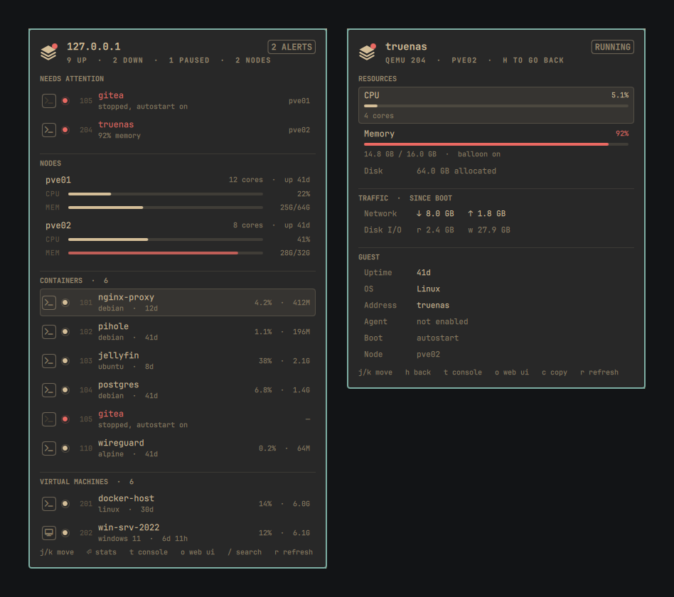
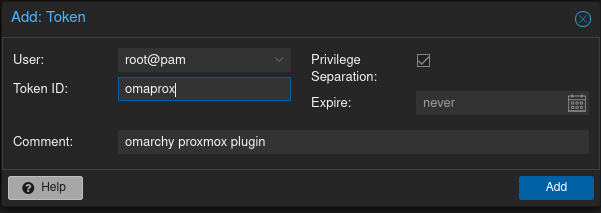
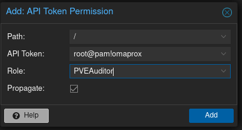

# Omaprox — Proxmox VE in the Omarchy bar

**[Live demo →](https://omaprox.andressm.com)** — every theme, no Proxmox required.

A read-only Proxmox VE dashboard for the Omarchy 4 (Quattro) bar: every
container and VM on your cluster with a status light, per-guest stats, and
one key to a console — `pct enter` for containers, SSH for Linux VMs,
`xfreerdp3` for Windows.



Omaprox is a dashboard, not a control panel. Nothing in it starts, stops,
migrates, snapshots or reconfigures a guest, so it only ever needs a
read-only API token.

## Install

```bash
omarchy plugin add https://github.com/AndresSM415/omaprox.git --enable
```

The command clones the repo into `~/.config/omarchy/plugins/`, validates it,
and asks where in the bar you want it. Plugins land disabled by default so
you can read the code first — `--enable` turns it on in the same step, or do
it separately:

```bash
omarchy plugin enable io.github.andressm415.omaprox
```

Plugins run unsandboxed inside the Omarchy shell process with your
permissions, so only add repos you trust. Omaprox installs nothing outside
its own folder: no hooks, no sudo, no files elsewhere on the system.

## Connect your cluster

Two steps: create a token in Proxmox, then write it to a file. Until both
are done the panel shows exactly which one is missing.

**1. Create a read-only API token.** In the Proxmox web UI, two screens:

- *Datacenter → Permissions → API Tokens → Add* creates the token: user,
  token ID, and *Privilege Separation* ticked. There is no role picker on
  this screen — a fresh token can do nothing yet.
  
- *Datacenter → Permissions → Permissions → Add → API Token Permission*:
  Path `/`, the token you just created, role `PVEAuditor`, *Propagate*
  ticked.

  

`PVEAuditor` is read-only and covers exactly what Omaprox needs. A token
that cannot stop a VM cannot stop a VM by accident — that is the point.

**2. Write it to a file:**

```bash
mkdir -p ~/.config/omaprox
printf 'host = pve01.lan\nroot@pam!omaprox=00000000-0000-0000-0000-000000000000\n' \
  > ~/.config/omaprox/token
chmod 600 ~/.config/omaprox/token
```

The first line is any node in the cluster — `pve01.lan`, `10.0.20.2` and
`https://pve01.lan:8006` all work; the scheme defaults to `https` and the
port to `8006`. The second line is your token. The file is watched, so
editing it takes effect without a restart.

The token lives in a file rather than in `shell.json` on purpose:
`shell.json` is a config file people paste into issues and copy between
machines, and an API token should not travel with it. `host` can still go in
`shell.json` if you prefer; the file wins when both are set.

**TLS.** Proxmox ships a self-signed certificate, so verification starts
off. Point `caCert` at your CA, or set `verifyTls` to `On` once the node has
a real certificate.

## Use the panel

Click the bar widget to open the overview: anything needing attention first,
then nodes, then containers, then VMs. Press Enter on a row for that guest's
stats. `o` opens the Proxmox web UI at the selected guest.

| Key | Action |
|---|---|
| `j` / `k`, arrows | move the cursor |
| `l` / Enter | open a guest's stats; on a node, the web UI |
| `h` / Escape | back out one level, then close the panel |
| `t` | console — terminal for a node or Linux guest, remote desktop for Windows |
| `o` | open the Proxmox web UI at this guest |
| `c` | copy the address |
| `/` | search by name, vmid, node or OS |
| `F` | forget a Windows guest's saved address and password (asks again next time) |
| `r` | refresh now |
| `Tab` | move to the next bar panel |

The panel does not poll while it is open, so a stat never resets to zero and
jumps mid-glance — `r` refreshes on demand. It keeps polling on its own
schedule while closed, so the bar icon and status lights stay current.

Mouse: left click toggles the panel, right click refreshes, middle click
opens the web UI.

**Status lights** use form and brightness rather than colour, so they read
well in monochrome themes: filled = running, hollow ring = stopped, dimmed =
paused, red = something needs attention — a running guest over its memory
threshold, a node offline, or a stopped guest with autostart on.

## Consoles

Press `t`, or click the left edge of a row. Nodes open a shell on
themselves; containers open `pct enter` on their node; Linux VMs open SSH;
Windows VMs open a remote desktop. A stopped guest's button stays in place,
dimmed and inert.

**First time on a Linux VM or Windows VM**, if the guest agent has not
reported an address and none is set in `shell.json`, the console opens in a
terminal and asks for one — a hostname or IP, whatever actually resolves to
that guest. It is remembered in `~/.config/omaprox/addresses`, keyed by
vmid, so you are only asked once per guest. Containers never ask: `pct
enter` always targets the node they live on, not the container itself.

**First time on a Linux guest**, the SSH helper also offers to install your
public key, and every connection after that is silent. Say no and it just
asks each time. No SSH password is ever stored — an authorized key is the
better version of "remember me".

**First time on a Windows guest**, the helper asks for username, password
and domain (blank for a local account), verifies them, and saves the
password to your login keyring. Later connections go straight to the
desktop. A saved password the server rejects is deleted and asked for
again.

**Got the wrong address, or need to redo credentials?** Press `F` on a
Windows guest to forget its saved address and password — the next console
attempt asks for both again, fresh. Linux guests have nothing to forget
this way: an installed SSH key is authorization granted on the guest
itself, not a secret held here, so it is removed from that account's
`~/.ssh/authorized_keys` on the guest, not through Omaprox. You can also
inspect or clear stored state directly:

```bash
cat ~/.config/omaprox/addresses                     # vmid = address, one per line
secret-tool search service omaprox                  # attributes print on stderr
secret-tool clear service omaprox host 192.168.1.50
```

Console dependencies: `openssh` for nodes, containers and Linux VMs,
`xfreerdp3` and `secret-tool` for Windows VMs.

## Configure

Placement:

```bash
omarchy bar move io.github.andressm415.omaprox --section right
```

Everything else lives in the widget's entry in
`~/.config/omarchy/shell.json`, which hot-reloads on save:

```jsonc
{ "id": "io.github.andressm415.omaprox", "host": "pve01.lan", "refreshIntervalSec": 10 }
```

| Key | Default | Meaning |
|---|---|---|
| `host` | — | any node in the cluster; scheme and port are filled in |
| `credentialsPath` | `~/.config/omaprox/token` | where the token file lives |
| `refreshIntervalSec` | 10 | how often the overview refreshes |
| `verifyTls` | `Off` | Proxmox self-signs, so verification starts off |
| `caCert` | — | PEM for your CA; setting it verifies regardless of `verifyTls` |
| `nodeSshUser` | `root` | user for the container console, which lands on the node |
| `guestSshUser` | `root` | user for the Linux VM console, which lands on the guest |
| `rdpUser` | — | Windows username, so FreeRDP asks only for the password. No password setting exists by design |
| `lxcConsoleCommand` | `ssh -t {nodeUser}@{node} pct enter {vmid}` | container console, runs in a floating terminal |
| `vmConsoleCommand` | `ssh -t {guestUser}@{address}` | Linux VM console, runs in a floating terminal |
| `rdpCommand` | `xfreerdp3 /v:{address} /dynamic-resolution +clipboard` | Windows console, launched directly |
| `memWarnPercent` | 90 | memory share that turns a light red |
| `showRunningCount` | `On` | show the number of running guests beside the bar icon |
| `showTemplates` | `Off` | templates never run, so they would be permanently dark rows |
| `agentAddresses` | `Off` | read VM addresses from the guest agent; needs `VM.Monitor` |
| `addresses` | — | per-vmid address overrides, keyed by vmid as a string — usually unnecessary, since the console prompts for and remembers an address itself the first time it needs one |

Placeholders for the three command templates: `{vmid}` `{name}` `{node}`
`{host}` `{address}` `{nodeUser}` `{guestUser}` `{rdpUser}`.

**Node names that do not resolve** — common when you reach Proxmox by IP and
have no local DNS — break the default container console, because `{node}` is
a Proxmox node *name*, not necessarily a hostname. On a single node use
`{host}` instead:

```jsonc
{ "id": "io.github.andressm415.omaprox",
  "lxcConsoleCommand": "ssh -t {nodeUser}@{host} pct enter {vmid}" }
```

On a cluster, `pct enter` has to run on the node the container lives on, so
keep `{node}` and give the node names to `/etc/hosts` or your resolver.

A guest whose name will not resolve is normally handled by the console's own
first-connection prompt (see [Consoles](#consoles)), which remembers the
address you give it. Set `addresses` in `shell.json` instead only if you
want it fixed in version-controlled config rather than in
`~/.config/omaprox/addresses` — it takes precedence over both the prompt and
whatever was previously remembered:

```jsonc
{ "id": "io.github.andressm415.omaprox", "addresses": { "202": "10.0.20.42" } }
```

## Troubleshooting

- **The panel says the token is missing.** `credentialsPath` must point at a
  file with `host = …` and `user@realm!tokenid=…` lines.
- **Every row shows an error.** Check the token's role and *Propagate* on
  *Permissions → Permissions*, the `host` address, and the TLS setting.
- **The widget does not appear in the bar.** Confirm it is enabled with
  `omarchy plugin list`, and inspect the shell log for QML errors.
- **The debug hatch is `omarchy-shell io.github.andressm415.omaprox diagnose`**,
  which dumps credential state, host resolution and the last error as JSON.

## Remove

```bash
omarchy plugin remove io.github.andressm415.omaprox
```

The plugin is a plain git checkout and installs nothing outside its own
directory. `~/.config/omaprox/` is left in place — delete it yourself if you
also want the token gone.

## License

MIT. Not affiliated with or endorsed by Proxmox Server Solutions GmbH.

Development notes for contributors: [docs/DEVELOPMENT.md](docs/DEVELOPMENT.md).
